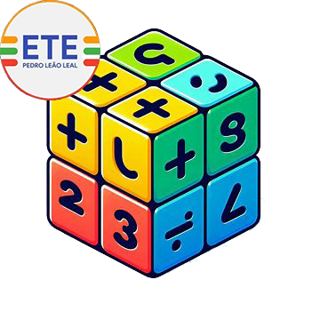

    

# Math Genius App

Math Genius é um aplicativo acadêmico focado na resolução de fórmulas matemáticas, onde é exibido tanto o resultado da equação tanto o próprio cálculo da mesma.

## Autores

### Wesllen Araújo - Desenvolvedor Web FrontEnd

## Tecnologias

## Versões

#### Versão mais recente: 1.0v.

 Math Genius App 1.0v (07/4/2024): Criação dos arquivos raízes do projeto.

## Instalação

Ainda não disponível para a instalação. O aplicativo está sendo trabalhado atualmente, mas poderá visitar o site da versão beta do Math Genius clicando [aqui](https://wesllenaraujo.github.io/Math-Genius/).
    
